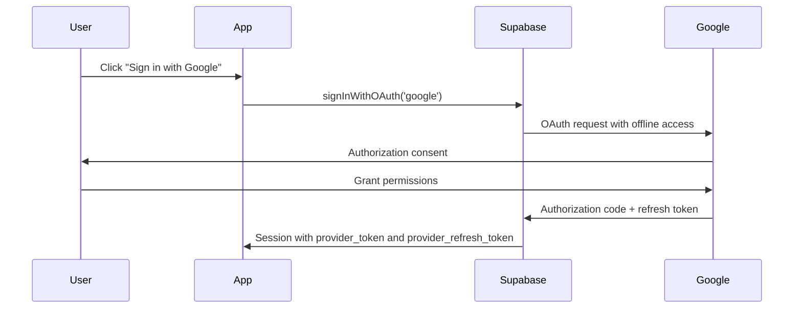
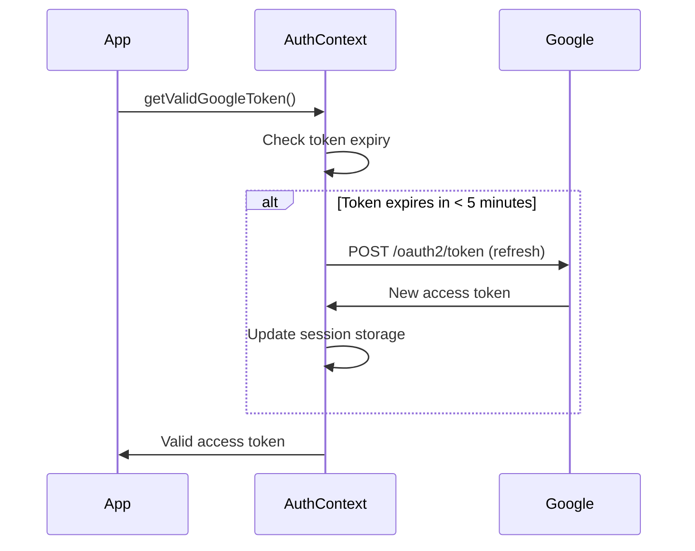
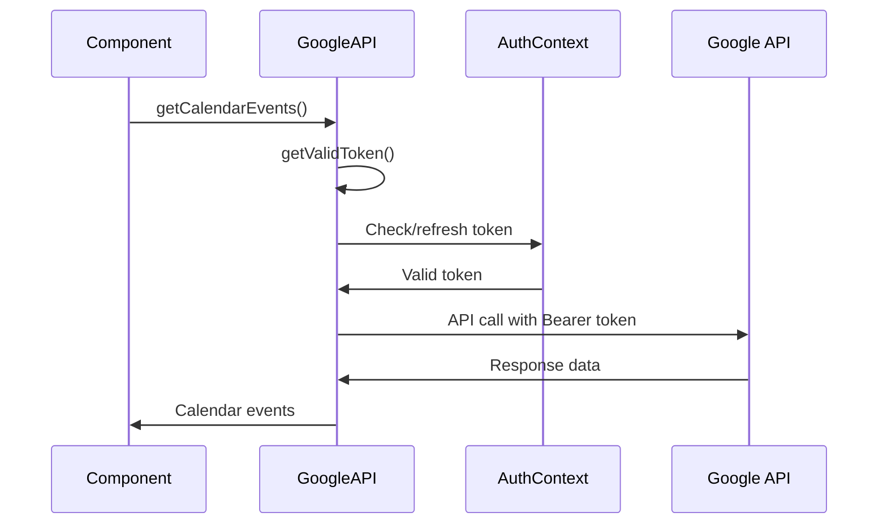

# Google OAuth Refresh Token Implementation

## Overview

This implementation adds automatic Google OAuth token refresh functionality to handle token expiration seamlessly. The system automatically refreshes expired or soon-to-expire tokens without requiring user re-authentication.

## Key Components

### 1. AuthContext Enhancement (`src/contexts/AuthContext.tsx`)

**New Methods:**
- `getValidGoogleToken()`: Returns a valid Google access token, automatically refreshing if needed
- `refreshGoogleToken()`: Manually refreshes the Google access token using the refresh token

**Usage Example:**
```typescript
const { getValidGoogleToken, refreshGoogleToken } = useAuth();

// Get a valid token (auto-refreshes if needed)
const token = await getValidGoogleToken();

// Manually refresh token
const { token, error } = await refreshGoogleToken();
```

### 2. Google API Service Enhancement (`src/services/googleApi.ts`)

**New Features:**
- Token management with automatic refresh
- Direct API calls instead of relying on gapi client
- Retry logic for expired tokens

**New Methods:**
- `setTokenRefreshCallback()`: Sets the callback function for token refresh
- `setToken()`: Sets the current access token and metadata
- `getValidToken()`: Gets a valid token with automatic refresh

### 3. Custom Hook (`src/hooks/useGoogleApi.ts`)

**Purpose:** Integrates GoogleApiService with AuthContext for easy component usage

**Usage Example:**
```typescript
import { useGoogleApi } from '../hooks/useGoogleApi';

const MyComponent = () => {
  const { googleApi, isAuthenticated, refreshToken } = useGoogleApi();

  const fetchEvents = async () => {
    try {
      const events = await googleApi.getCalendarEvents();
      console.log('Calendar events:', events);
    } catch (error) {
      console.error('Failed to fetch events:', error);
    }
  };

  return (
    <div>
      {isAuthenticated ? (
        <button onClick={fetchEvents}>Fetch Events</button>
      ) : (
        <p>Please sign in with Google</p>
      )}
    </div>
  );
};
```

## Configuration Requirements

### Environment Variables

```env
VITE_GOOGLE_CLIENT_ID=your_google_client_id
VITE_GOOGLE_API_KEY=your_google_api_key
VITE_SUPABASE_URL=your_supabase_url
VITE_SUPABASE_ANON_KEY=your_supabase_anon_key
```

### Google OAuth Setup

1. **Enable APIs:**
   - Google Calendar API
   - Gmail API
   - Google+ API (for user info)

2. **OAuth Consent Screen:**
   - Configure scopes: `calendar.events`, `gmail.readonly`, `userinfo.email`, `userinfo.profile`
   - Set redirect URI: `your-domain.com`

3. **OAuth Client Configuration:**
   - Type: Web application
   - Authorized redirect URIs: Include your Supabase auth callback URL

## How Token Refresh Works

### 1. Initial Authentication


### 2. Token Refresh Process


### 3. API Call with Auto-Refresh


## Implementation Details

### Token Expiry Management
- Tokens are checked for expiry with a 5-minute buffer
- Automatic refresh is triggered before expiration
- Fallback to session storage for immediate token access

### Error Handling
- Network failures during refresh are logged and propagated
- Invalid refresh tokens trigger re-authentication flow
- API errors are caught and reported with context

### Session Management
- Tokens are stored in both Supabase session and session storage
- Session storage provides immediate access without async calls
- Supabase session maintains long-term persistence

## Usage Patterns

### 1. Simple API Calls
```typescript
const { googleApi } = useGoogleApi();

// API calls automatically handle token refresh
const events = await googleApi.getCalendarEvents();
const messages = await googleApi.getGmailMessages();
```

### 2. Manual Token Management
```typescript
const { getValidGoogleToken } = useAuth();

// Get token for custom API calls
const token = await getValidGoogleToken();
const response = await fetch('https://www.googleapis.com/calendar/v3/calendars', {
  headers: { Authorization: `Bearer ${token}` }
});
```

### 3. Error Recovery
```typescript
const { googleApi, refreshToken } = useGoogleApi();

try {
  const events = await googleApi.getCalendarEvents();
} catch (error) {
  if (error.message.includes('401') || error.message.includes('authentication')) {
    // Try manual refresh
    const { token, error: refreshError } = await refreshToken();
    if (token) {
      // Retry the operation
      const events = await googleApi.getCalendarEvents();
    }
  }
}
```

## Benefits

1. **Seamless User Experience:** No re-authentication required for token expiry
2. **Automatic Management:** Tokens are refreshed transparently
3. **Error Resilience:** Graceful handling of network and auth errors
4. **Developer Friendly:** Simple hooks and service interfaces
5. **Type Safety:** Full TypeScript support with proper error types

## Migration Guide

### From Old Implementation
1. Replace `session.provider_token` with `getValidGoogleToken()`
2. Use `useGoogleApi()` hook instead of direct gapi calls
3. Remove manual token checking logic
4. Update error handling to use new error types

### Example Migration
```typescript
// OLD
const googleToken = session?.provider_token;
if (!googleToken) throw new Error('No token');

// NEW
const googleToken = await getValidGoogleToken();
if (!googleToken) throw new Error('No valid token available');
```

This implementation ensures reliable Google API access with minimal user intervention and developer complexity.
