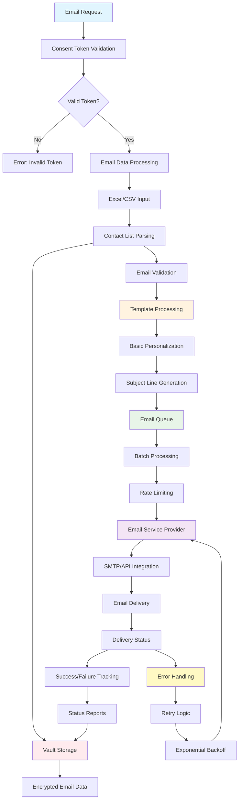

# Mailer Agent - Basic Email Sending Service

## Agent Architecture Flow

## Workflow Description

### 1. Input Processing
- **Email Request**: Basic email sending requests
- **Consent Validation**: HushhMCP token verification for email permissions
- **Data Processing**: Parse contact lists and email content

### 2. Contact Management
- **Excel/CSV Support**: Import contact lists from spreadsheet files
- **Email Validation**: Verify email address formats and deliverability
- **List Segmentation**: Organize contacts for targeted campaigns

### 3. Email Preparation
- **Template Processing**: Apply email templates and formatting
- **Basic Personalization**: Simple mail merge functionality
- **Subject Line Generation**: Create appropriate subject lines

### 4. Delivery Management
- **Queue System**: Organize emails for optimal delivery timing
- **Batch Processing**: Send emails in manageable batches
- **Rate Limiting**: Respect email service provider limits

### 5. Email Sending
- **Service Integration**: Connect with SMTP servers or email APIs
- **Delivery Tracking**: Monitor email sending status
- **Error Handling**: Automatic retry with exponential backoff

### 6. Reporting & Storage
- **Status Tracking**: Monitor delivery success and failures
- **Performance Reports**: Generate sending statistics
- **Encrypted Storage**: Secure storage of email data and results

## Key Features
- 📧 **Basic Email Sending**: Reliable email delivery service
- 📊 **Excel/CSV Support**: Import contacts from spreadsheet files
- 🔄 **Batch Processing**: Efficient bulk email handling
- 📈 **Delivery Tracking**: Monitor email sending status
- 🔒 **Secure Storage**: Encrypted data management
- ⚙️ **Error Handling**: Robust retry and error recovery

## API Endpoints
- `POST /agents/mailer/execute` - Send email campaigns
- `GET /agents/mailer/status` - Check sending status
- `POST /agents/mailer/upload` - Upload contact lists
- `GET /agents/mailer/reports` - Delivery reports

## Supported Features
- **Contact Import**: Excel, CSV file support
- **Template System**: Basic email templates
- **Personalization**: Simple mail merge capabilities
- **Delivery Tracking**: Real-time status monitoring
- **Bulk Sending**: Efficient batch processing

## Differences from MailerPanda
- **Simpler Interface**: Basic email sending without AI
- **No AI Generation**: Manual template creation
- **Basic Personalization**: Simple variable substitution
- **Direct Sending**: No human approval workflow
- **Lightweight**: Minimal dependencies and features