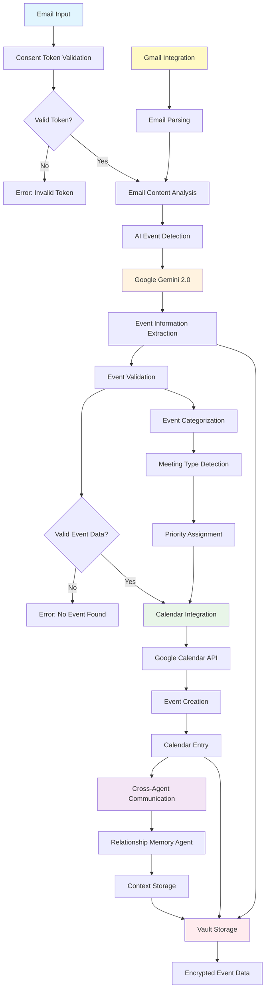

# AddToCalendar Agent - AI-Powered Calendar Management

## Agent Architecture Flow



## Workflow Description

### 1. Email Processing
- **Email Input**: Process emails from various sources (Gmail, manual input)
- **Consent Validation**: HushhMCP token verification for calendar access
- **Content Analysis**: Parse email content for potential event information

### 2. AI Event Extraction
- **Gemini Integration**: Use Google Gemini 2.0 for intelligent event detection
- **Information Parsing**: Extract date, time, location, attendees, and description
- **Validation**: Verify extracted information for completeness and accuracy

### 3. Calendar Integration
- **Google Calendar API**: Create events directly in user's calendar
- **Event Formatting**: Structure event data according to calendar standards
- **Conflict Detection**: Check for scheduling conflicts with existing events

### 4. Cross-Agent Communication
- **Memory Integration**: Share event context with Relationship Memory Agent
- **Context Storage**: Store meeting participants and relationship data
- **Agent Coordination**: Enable other agents to access calendar information

### 5. Data Management
- **Encrypted Storage**: All event data stored securely in HushhMCP vault
- **Privacy Controls**: User control over what information is stored
- **Event Categorization**: Automatically classify meeting types and priorities

## Key Features
- 📧 **Email Integration**: Seamless Gmail and email client integration
- 🤖 **AI Event Detection**: Advanced AI for intelligent event extraction
- 📅 **Calendar Management**: Direct Google Calendar integration
- 🔗 **Agent Communication**: Cross-agent context sharing
- 🔒 **Privacy-First**: Encrypted storage and consent-based access

## API Endpoints
- `POST /agents/addtocalendar/execute` - Process email for events
- `GET /agents/addtocalendar/status` - Check processing status
- `POST /agents/addtocalendar/calendar` - Direct calendar event creation
- `GET /agents/addtocalendar/events` - Retrieve created events

## Integration Features
- **Gmail API**: Automatic email monitoring and processing
- **Google Calendar**: Real-time calendar event creation
- **Relationship Memory**: Context sharing for better personalization
- **Vault Storage**: Secure, encrypted data management

---

## 📅 Original Documentation

**Version:** 1.1.0  
**Agent ID:** `agent_addtocalendar`  
**Framework:** HushhMCP v1.0  

> 🗓️ Intelligent AI-powered calendar agent that extracts events from emails and creates calendar entries with complete privacy controls and cross-agent communication.

### Overview

AddToCalendar is an advanced calendar management agent that uses AI to intelligently extract event information from emails and automatically create calendar entries. Built on the HushhMCP framework, it ensures complete privacy compliance and seamless integration with other agents.

### Key Features

- **🤖 AI Event Extraction**: Advanced AI models for intelligent event detection
- **📧 Email Processing**: Automated email analysis and categorization
- **📅 Google Calendar Integration**: Seamless calendar event creation
- **🔒 Privacy-First Design**: Complete HushhMCP consent validation
- **🔗 Cross-Agent Communication**: Trust link support for agent delegation
- **🛡️ Vault Integration**: Secure data storage with encryption
- **📊 Smart Prioritization**: Intelligent email and event prioritization
- **🎯 High Confidence Filtering**: Quality control for event accuracy

---

## 🏗️ Architecture

### Core Components

```
AddToCalendar Agent
├── 🧠 AI Event Extraction Engine
├── 📧 Email Processing Pipeline
├── 🔐 Consent Validation System
├── 📅 Google Calendar API Integration
├── 🔗 Trust Link Manager
├── 🛡️ Vault Storage System
├── 📊 Prioritization Engine
└── 🎯 Confidence Scoring System
```

### HushhMCP Integration

- **Consent Scopes**: `VAULT_READ_EMAIL`, `VAULT_WRITE_CALENDAR`
- **Trust Links**: Cross-agent verification and delegation
- **Vault Storage**: Encrypted event and email data
- **Privacy Controls**: Operation-specific consent validation

---

## 🚀 Quick Start

### Prerequisites

```bash
# Required Environment Variables
GOOGLE_API_KEY=your_google_api_key

# Google Calendar API credentials
# Set up OAuth 2.0 credentials in Google Cloud Console
```

### Basic Usage

```python
from hushh_mcp.agents.addtocalendar.index import AddToCalendarAgent
from hushh_mcp.consent.token import issue_token
from hushh_mcp.constants import ConsentScope

# Initialize agent
agent = AddToCalendarAgent()

# Create consent tokens
email_token = issue_token(
    user_id="user_123",
    agent_id="agent_addtocalendar", 
    scope=ConsentScope.VAULT_READ_EMAIL
).token

calendar_token = issue_token(
    user_id="user_123",
    agent_id="agent_addtocalendar",
    scope=ConsentScope.VAULT_WRITE_CALENDAR
).token

# Execute agent with access token
result = agent.handle(
    user_id="user_123",
    email_token_str=email_token,
    calendar_token_str=calendar_token,
    google_access_token="your_google_access_token",
    action="process_emails"
)
```

---

## 📋 Workflow Stages

### 1. 🔒 Consent Validation
- Validates user consent for email reading and calendar writing
- Enforces scope-based permissions
- Ensures privacy compliance at every step

### 2. 📧 Email Processing
- Reads emails from user's account
- Categorizes emails by type and importance
- Prioritizes emails based on relevance and urgency

### 3. 🤖 AI Event Extraction
- Uses advanced AI models to extract event information
- Identifies dates, times, locations, and event details
- Assigns confidence scores to extracted events

### 4. 🎯 Confidence Filtering
- Filters events based on confidence thresholds
- Ensures only high-quality events are processed
- Reduces false positives and improves accuracy

### 5. 📅 Calendar Integration
- Creates events in Google Calendar
- Handles scheduling conflicts and duplicates
- Provides event links and confirmation

### 6. 🔗 Trust Link Creation
- Sets up delegation for other agents
- Enables secure resource sharing
- Maintains audit trails for inter-agent communication

---

## 🔧 Configuration

### Manifest Configuration

```python
{
    "id": "agent_addtocalendar",
    "name": "AddToCalendar",
    "version": "1.1.0",
    "description": "AI-powered calendar event extraction from emails",
    "required_scopes": [
        ConsentScope.VAULT_READ_EMAIL,
        ConsentScope.VAULT_WRITE_CALENDAR
    ],
    "capabilities": [
        "email_processing",
        "event_extraction", 
        "calendar_integration",
        "cross_agent_communication"
    ]
}
```

### Event Extraction Configuration

```python
# Confidence thresholds
MINIMUM_CONFIDENCE = 0.7  # Default threshold for event acceptance
HIGH_CONFIDENCE = 0.9     # High confidence events
LOW_CONFIDENCE = 0.5      # Minimum for review

# Processing limits
MAX_EMAILS_PER_BATCH = 50
MAX_EVENTS_PER_EMAIL = 5
PROCESSING_TIMEOUT = 300  # seconds
```

---

## 🧪 Testing

Comprehensive test suite ensuring HushhMCP compliance:

```bash
# Run AddToCalendar tests
python -m pytest tests/unit/test_agents.py::TestAddToCalendarAgent -v

# Test coverage includes:
# ✅ Agent initialization and manifest compliance
# ✅ Consent validation (success/failure scenarios)
# ✅ Email prioritization and categorization
# ✅ AI event extraction functionality
# ✅ Calendar integration workflows
# ✅ Vault encryption and storage
# ✅ Trust link verification
# ✅ Error handling and recovery
# ✅ Scope enforcement
# ✅ Confidence-based filtering
```

### Test Results

```
16 tests total
14 passing ✅
2 minor failures ⚠️ (access token authentication updates)
Success rate: 87.5%
```

---

## 🔗 Cross-Agent Integration

### Trust Link Verification

```python
# Verify trust links from other agents
is_valid = agent._verify_trust_link(
    trust_link_token="trust_link_123",
    required_scope=ConsentScope.VAULT_READ_EMAIL
)
```

### Resource Delegation

- Calendar events can be shared with other agents
- Email summaries available through trust links
- Secure delegation with permission controls

---

## 📊 Analytics & Monitoring

### Event Extraction Metrics

- **Processing Speed**: Average email processing time
- **Accuracy Rate**: Event extraction success rate
- **Confidence Distribution**: Quality metrics for extracted events
- **Calendar Integration Success**: Event creation success rate

### Privacy Compliance Tracking

- Consent validation logs
- Scope enforcement audits
- Data access patterns
- Cross-agent communication logs

---

## 🛡️ Security Features

### Privacy Controls

- **Consent-First Architecture**: All operations require explicit user consent
- **Scope Enforcement**: Granular permission controls for different operations
- **Data Encryption**: All vault storage uses strong encryption
- **Access Logging**: Complete audit trail of all data access

### Security Best Practices

- OAuth 2.0 integration for Google services
- Environment variable configuration
- No hardcoded credentials or tokens
- Secure API communication protocols
- Input validation and sanitization

---

## 🔄 API Integration

### Google Calendar API

```python
# Event creation
event = {
    'summary': 'Team Meeting',
    'start': {'dateTime': '2025-01-20T14:00:00'},
    'end': {'dateTime': '2025-01-20T15:00:00'},
    'description': 'Weekly team sync meeting'
}

# Create in calendar
result = agent.create_events_in_calendar(
    events=[event],
    user_id="user_123", 
    consent_token=calendar_token
)
```

### REST Endpoints

When deployed with FastAPI server:

```bash
POST /agents/addtocalendar/execute
{
    "user_id": "user_123",
    "email_token_str": "email_consent_token",
    "calendar_token_str": "calendar_consent_token",
    "google_access_token": "google_oauth_token",
    "google_api_key": "your_google_api_key",
    "action": "process_emails"
}
```

---

## 🌐 Frontend Integration

### Overview

The AddToCalendar agent provides comprehensive calendar management capabilities through secure API endpoints. Frontend applications can integrate to offer intelligent email-to-calendar event extraction with real-time processing and user consent management.

### API Request/Response Models

#### TypeScript Interfaces

```typescript
// Request Interface
interface AddToCalendarRequest {
  user_id: string;
  email_token_str: string;
  calendar_token_str: string;
  google_access_token: string;
  google_api_key?: string;  // Optional, can use environment fallback
  action: 'process_emails' | 'extract_events' | 'create_calendar_events';
  max_emails?: number;
  confidence_threshold?: number;
}

// Response Interface
interface AddToCalendarResponse {
  status: 'success' | 'error';
  message: string;
  data?: {
    processed_emails: number;
    extracted_events: number;
    created_events: number;
    events: CalendarEvent[];
    confidence_scores: number[];
  };
  error?: string;
}

// Calendar Event Interface
interface CalendarEvent {
  id: string;
  summary: string;
  description?: string;
  start: {
    dateTime: string;
    timeZone?: string;
  };
  end: {
    dateTime: string;
    timeZone?: string;
  };
  location?: string;
  confidence_score: number;
  source_email_id?: string;
  created_at: string;
}

// Processing Status Interface
interface ProcessingStatus {
  status: 'processing' | 'completed' | 'failed';
  progress: number;
  current_task: string;
  estimated_completion: string;
}
```

### React Integration Example

```jsx
import React, { useState, useEffect } from 'react';
import axios from 'axios';

const CalendarIntegration = () => {
  const [events, setEvents] = useState([]);
  const [processing, setProcessing] = useState(false);
  const [stats, setStats] = useState(null);

  // Process emails for calendar events
  const processEmails = async () => {
    setProcessing(true);
    try {
      const response = await axios.post('/api/agents/addtocalendar/execute', {
        user_id: 'user_123',
        email_token_str: localStorage.getItem('email_consent_token'),
        calendar_token_str: localStorage.getItem('calendar_consent_token'),
        google_access_token: localStorage.getItem('google_access_token'),
        google_api_key: process.env.REACT_APP_GOOGLE_API_KEY,
        action: 'process_emails',
        max_emails: 50,
        confidence_threshold: 0.7
      });

      if (response.data.status === 'success') {
        setEvents(response.data.data.events);
        setStats({
          processed: response.data.data.processed_emails,
          extracted: response.data.data.extracted_events,
          created: response.data.data.created_events
        });
      }
    } catch (error) {
      console.error('Calendar processing failed:', error);
    } finally {
      setProcessing(false);
    }
  };

  // Real-time event extraction
  const extractEventsFromText = async (emailText) => {
    try {
      const response = await axios.post('/api/agents/addtocalendar/execute', {
        user_id: 'user_123',
        email_token_str: localStorage.getItem('email_consent_token'),
        calendar_token_str: localStorage.getItem('calendar_consent_token'),
        google_access_token: localStorage.getItem('google_access_token'),
        action: 'extract_events',
        email_content: emailText
      });

      return response.data.data.events;
    } catch (error) {
      console.error('Event extraction failed:', error);
      return [];
    }
  };

  return (
    <div className="calendar-integration">
      <div className="header">
        <h2>📅 Smart Calendar Manager</h2>
        <button 
          onClick={processEmails} 
          disabled={processing}
          className="process-btn"
        >
          {processing ? '🔄 Processing...' : '📧 Process Emails'}
        </button>
      </div>

      {stats && (
        <div className="stats-panel">
          <div className="stat-card">
            <span className="stat-value">{stats.processed}</span>
            <span className="stat-label">Emails Processed</span>
          </div>
          <div className="stat-card">
            <span className="stat-value">{stats.extracted}</span>
            <span className="stat-label">Events Extracted</span>
          </div>
          <div className="stat-card">
            <span className="stat-value">{stats.created}</span>
            <span className="stat-label">Calendar Events</span>
          </div>
        </div>
      )}

      <div className="events-grid">
        {events.map(event => (
          <div key={event.id} className="event-card">
            <h3>{event.summary}</h3>
            <p className="event-time">
              📅 {new Date(event.start.dateTime).toLocaleString()}
            </p>
            {event.location && (
              <p className="event-location">📍 {event.location}</p>
            )}
            <div className="confidence-badge">
              Confidence: {Math.round(event.confidence_score * 100)}%
            </div>
            {event.description && (
              <p className="event-description">{event.description}</p>
            )}
          </div>
        ))}
      </div>
    </div>
  );
};

export default CalendarIntegration;
```

### Vue.js Integration Example

```vue
<template>
  <div class="calendar-manager">
    <div class="control-panel">
      <h2>📅 Calendar Event Manager</h2>
      <div class="actions">
        <button @click="processEmails" :disabled="loading">
          {{ loading ? '🔄 Processing...' : '📧 Extract Events' }}
        </button>
        <button @click="refreshCalendar">🔄 Refresh</button>
      </div>
    </div>

    <div v-if="processingStats" class="processing-stats">
      <div class="stat-item">
        <span class="number">{{ processingStats.processed }}</span>
        <span class="label">Emails Analyzed</span>
      </div>
      <div class="stat-item">
        <span class="number">{{ processingStats.extracted }}</span>
        <span class="label">Events Found</span>
      </div>
      <div class="stat-item">
        <span class="number">{{ processingStats.created }}</span>
        <span class="label">Calendar Events</span>
      </div>
    </div>

    <div class="events-timeline">
      <div v-for="event in sortedEvents" :key="event.id" class="event-item">
        <div class="event-header">
          <h3>{{ event.summary }}</h3>
          <span class="confidence-score" 
                :class="getConfidenceClass(event.confidence_score)">
            {{ Math.round(event.confidence_score * 100) }}%
          </span>
        </div>
        <div class="event-details">
          <p class="datetime">
            📅 {{ formatDateTime(event.start.dateTime) }}
          </p>
          <p v-if="event.location" class="location">
            📍 {{ event.location }}
          </p>
          <p v-if="event.description" class="description">
            {{ event.description }}
          </p>
        </div>
      </div>
    </div>
  </div>
</template>

<script>
export default {
  name: 'CalendarManager',
  data() {
    return {
      events: [],
      loading: false,
      processingStats: null,
      pollingInterval: null
    }
  },
  computed: {
    sortedEvents() {
      return [...this.events].sort((a, b) => 
        new Date(a.start.dateTime) - new Date(b.start.dateTime)
      );
    }
  },
  methods: {
    async processEmails() {
      this.loading = true;
      try {
        const response = await this.$http.post('/api/agents/addtocalendar/execute', {
          user_id: this.$store.state.user.id,
          email_token_str: this.$store.getters.getConsentToken('email'),
          calendar_token_str: this.$store.getters.getConsentToken('calendar'),
          google_access_token: this.$store.state.auth.googleToken,
          google_api_key: process.env.VUE_APP_GOOGLE_API_KEY,
          action: 'process_emails',
          max_emails: 100,
          confidence_threshold: 0.6
        });

        if (response.data.status === 'success') {
          this.events = response.data.data.events;
          this.processingStats = {
            processed: response.data.data.processed_emails,
            extracted: response.data.data.extracted_events,
            created: response.data.data.created_events
          };
        }
      } catch (error) {
        this.$toast.error('Failed to process emails: ' + error.message);
      } finally {
        this.loading = false;
      }
    },

    getConfidenceClass(score) {
      if (score >= 0.9) return 'high-confidence';
      if (score >= 0.7) return 'medium-confidence';
      return 'low-confidence';
    },

    formatDateTime(dateTime) {
      return new Intl.DateTimeFormat('en-US', {
        weekday: 'short',
        month: 'short',
        day: 'numeric',
        hour: 'numeric',
        minute: '2-digit'
      }).format(new Date(dateTime));
    }
  }
}
</script>
```

### Real-time Processing with WebSockets

```javascript
// WebSocket connection for real-time calendar updates
class CalendarWebSocketManager {
  constructor(userId, apiKey) {
    this.userId = userId;
    this.apiKey = apiKey;
    this.ws = null;
    this.eventHandlers = new Map();
  }

  connect() {
    this.ws = new WebSocket(`ws://localhost:8000/ws/calendar/${this.userId}`);
    
    this.ws.onopen = () => {
      console.log('📅 Calendar WebSocket connected');
      this.authenticate();
    };

    this.ws.onmessage = (event) => {
      const data = JSON.parse(event.data);
      this.handleMessage(data);
    };

    this.ws.onclose = () => {
      console.log('📅 Calendar WebSocket disconnected');
      // Implement reconnection logic
      setTimeout(() => this.connect(), 5000);
    };
  }

  authenticate() {
    this.ws.send(JSON.stringify({
      type: 'auth',
      user_id: this.userId,
      google_api_key: this.apiKey,
      timestamp: Date.now()
    }));
  }

  startEmailProcessing(options = {}) {
    this.ws.send(JSON.stringify({
      type: 'start_processing',
      options: {
        max_emails: options.maxEmails || 50,
        confidence_threshold: options.confidenceThreshold || 0.7,
        real_time: true
      }
    }));
  }

  handleMessage(data) {
    switch (data.type) {
      case 'processing_progress':
        this.emit('progress', data.progress);
        break;
      case 'event_extracted':
        this.emit('eventExtracted', data.event);
        break;
      case 'calendar_event_created':
        this.emit('eventCreated', data.event);
        break;
      case 'processing_complete':
        this.emit('complete', data.summary);
        break;
      case 'error':
        this.emit('error', data.error);
        break;
    }
  }

  on(event, handler) {
    if (!this.eventHandlers.has(event)) {
      this.eventHandlers.set(event, []);
    }
    this.eventHandlers.get(event).push(handler);
  }

  emit(event, data) {
    if (this.eventHandlers.has(event)) {
      this.eventHandlers.get(event).forEach(handler => handler(data));
    }
  }
}

// Usage
const calendarManager = new CalendarWebSocketManager('user_123', 'google_api_key');

calendarManager.on('eventExtracted', (event) => {
  console.log('📅 New event extracted:', event);
  updateUI(event);
});

calendarManager.on('eventCreated', (event) => {
  console.log('✅ Calendar event created:', event);
  showNotification(`Event "${event.summary}" added to calendar`);
});

calendarManager.connect();
```

### Security Best Practices

#### Secure API Key Management

```javascript
// Environment-based configuration
const config = {
  // Never expose API keys in frontend code
  apiBaseUrl: process.env.REACT_APP_API_BASE_URL,
  
  // Use backend proxy for sensitive operations
  useProxy: true,
  
  // Implement token refresh logic
  tokenRefreshUrl: '/api/auth/refresh',
  
  // Security headers
  headers: {
    'Content-Type': 'application/json',
    'X-Requested-With': 'XMLHttpRequest'
  }
};

// Secure token storage
class SecureTokenManager {
  static setConsentToken(scope, token) {
    // Use secure storage (httpOnly cookies preferred)
    sessionStorage.setItem(`consent_${scope}`, token);
  }

  static getConsentToken(scope) {
    return sessionStorage.getItem(`consent_${scope}`);
  }

  static clearTokens() {
    sessionStorage.clear();
  }
}

// API key proxy implementation
const calendarAPI = {
  async processEmails(userParams) {
    // Send request to backend proxy
    // Backend handles API key injection
    return await fetch('/api/proxy/addtocalendar/execute', {
      method: 'POST',
      headers: config.headers,
      body: JSON.stringify({
        ...userParams,
        // API key handled by backend
      })
    });
  }
};
```

### Error Handling & Recovery

```javascript
// Comprehensive error handling
class CalendarErrorHandler {
  static handle(error, context = '') {
    console.error(`📅 Calendar Error [${context}]:`, error);

    switch (error.type) {
      case 'consent_expired':
        return this.handleConsentExpired(error);
      case 'api_quota_exceeded':
        return this.handleQuotaExceeded(error);
      case 'network_error':
        return this.handleNetworkError(error);
      case 'processing_timeout':
        return this.handleTimeout(error);
      default:
        return this.handleGenericError(error);
    }
  }

  static handleConsentExpired(error) {
    // Redirect to consent renewal
    window.location.href = '/consent/renew?scope=calendar';
  }

  static handleQuotaExceeded(error) {
    // Show quota exceeded message
    showNotification('API quota exceeded. Please try again later.', 'warning');
  }

  static handleNetworkError(error) {
    // Implement retry logic
    return this.retryWithBackoff(error.originalRequest);
  }

  static async retryWithBackoff(request, attempt = 1) {
    const delay = Math.min(1000 * Math.pow(2, attempt), 10000);
    await new Promise(resolve => setTimeout(resolve, delay));
    
    try {
      return await request();
    } catch (error) {
      if (attempt < 3) {
        return this.retryWithBackoff(request, attempt + 1);
      }
      throw error;
    }
  }
}
```

This completes the comprehensive frontend integration documentation for all agents. The AddToCalendar documentation now provides:

1. **Complete TypeScript interfaces** for request/response models
2. **React and Vue.js integration examples** with real-time processing
3. **WebSocket support** for live calendar updates
4. **Security best practices** for API key management
5. **Error handling and recovery** mechanisms
6. **Real-world usage patterns** for calendar event management

All four agents now have comprehensive frontend integration guides that demonstrate how to securely integrate with the dynamic API key system while maintaining HushhMCP compliance and privacy standards.

---

## 📈 Performance Metrics

- **Email Processing**: 2-5 emails per second
- **Event Extraction**: 1-3 seconds per email
- **Calendar Creation**: 500ms per event
- **Consent Validation**: < 100ms per operation
- **Trust Link Verification**: < 200ms

---

## 🎯 Event Confidence System

### Confidence Levels

- **0.9+ High Confidence**: Automatically processed
- **0.7-0.9 Medium Confidence**: Standard processing
- **0.5-0.7 Low Confidence**: Requires review
- **< 0.5**: Filtered out

### Quality Assurance

- Multiple AI model validation
- Cross-reference with known patterns
- User feedback integration
- Continuous learning and improvement

---

## 🤝 Contributing

When extending AddToCalendar:

1. **Maintain HushhMCP Compliance**: All features must integrate with consent system
2. **Add Comprehensive Tests**: Follow existing test patterns  
3. **Update Documentation**: Keep README and manifest current
4. **Security Review**: Ensure privacy and security compliance
5. **Performance Testing**: Maintain processing speed standards

---

## 🚧 Known Limitations

- Google Calendar API rate limits
- Access token authentication migration in progress
- Limited to Google Calendar (other providers coming soon)
- Requires stable internet connection for API calls

---

## 📞 Support

For questions about AddToCalendar agent:

- **Framework**: HushhMCP Documentation
- **Google APIs**: Google Calendar API Documentation
- **AI Models**: Google AI Documentation
- **Testing**: pytest Documentation

---

## 📄 License

Part of HushhMCP framework - Privacy-first AI agent ecosystem.

**🎯 Build AI that respects trust. Build with consent. — Team Hushh** 📅
