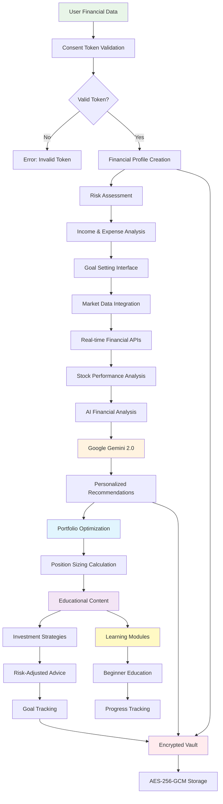

# ChanduFinance Agent - AI-Powered Personal Financial Advisor

## Agent Architecture Flow

## Workflow Description

### 1. Financial Profile Setup
- **Data Collection**: Income, expenses, savings, investment experience
- **Consent Validation**: HushhMCP token verification for financial data access
- **Risk Assessment**: Comprehensive analysis of user's risk tolerance and financial situation

### 2. Market Analysis
- **Real-time Data**: Integration with financial APIs for current market information
- **Performance Analysis**: Stock trends, economic indicators, market sentiment
- **Personalized Screening**: Filter investments based on user's risk profile

### 3. AI-Powered Advice
- **Gemini Integration**: Advanced AI analysis using Google Gemini 2.0
- **Portfolio Optimization**: Mathematical models for asset allocation
- **Position Sizing**: Risk-appropriate investment amount recommendations

### 4. Educational Component
- **Explain Like I'm New**: Beginner-friendly explanations of complex concepts
- **Interactive Modules**: Step-by-step learning paths
- **Progress Tracking**: Achievement system to encourage continued learning

### 5. Goal Management
- **Short-term Goals**: Emergency fund, debt repayment planning
- **Long-term Goals**: Retirement planning, major purchases
- **Timeline Tracking**: Progress monitoring with milestone alerts

## Key Features
- 📊 **Real-time Market Data**: Live financial information and analysis
- 🎯 **Goal-based Planning**: Customized strategies for financial objectives
- 📚 **Financial Education**: Comprehensive learning resources
- 🔐 **Privacy-First**: Encrypted storage of all financial data
- 🤖 **AI Recommendations**: Personalized investment advice using advanced AI

## API Endpoints
- `POST /agents/chandufinance/execute` - Generate financial analysis
- `POST /agents/chandufinance/portfolio` - Portfolio optimization
- `GET /agents/chandufinance/education` - Educational content
- `POST /agents/chandufinance/goals` - Goal tracking and planning

## Available Commands
- `setup_profile` - Create comprehensive financial profile
- `personal_stock_analysis` - AI-powered stock analysis
- `add_goal` - Create financial goals with timelines
- `explain_like_im_new` - Beginner-friendly explanations
- `investment_education` - Structured learning modules