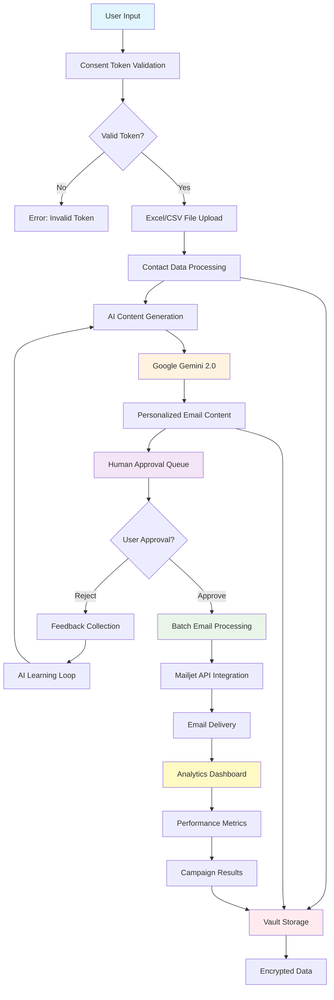

# MailerPanda Agent - AI-Powered Email Marketing with Human Oversight

## Agent Architecture Flow



## Workflow Description

### 1. Input Processing
- **User Input**: Campaign parameters and requirements
- **Consent Validation**: HushhMCP token verification for email permissions
- **File Upload**: Excel/CSV contact lists with recipient data

### 2. AI Content Generation
- **Data Analysis**: Parse recipient information and preferences
- **Gemini Integration**: Generate personalized email content using Google Gemini 2.0
- **Personalization**: Create contextually relevant messages beyond simple name replacement

### 3. Human-in-the-Loop Approval
- **Review Queue**: All AI-generated content requires human approval
- **Feedback System**: Users can approve, reject, or modify content
- **Learning Loop**: AI improves based on user feedback patterns

### 4. Email Delivery
- **Batch Processing**: Optimize delivery timing and rate limiting
- **Mailjet Integration**: Reliable email service provider integration
- **Error Handling**: Automatic retry with exponential backoff

### 5. Analytics & Storage
- **Performance Tracking**: Open rates, click-through rates, engagement metrics
- **Encrypted Storage**: All data stored in HushhMCP vault with AES-256-GCM
- **Campaign Analytics**: Comprehensive dashboard for campaign insights

## Key Features
- 🔐 **Cryptographic Consent**: Every action requires validated consent tokens
- 🤖 **AI Personalization**: Beyond basic mail merge using advanced AI
- 👥 **Human Oversight**: Quality control through approval workflows
- 📊 **Analytics**: Real-time performance monitoring
- 🔒 **Privacy**: End-to-end encryption for all personal data

## API Endpoints
- `POST /agents/mailerpanda/execute` - Generate email campaigns
- `POST /agents/mailerpanda/approve` - Human approval workflow
- `GET /agents/mailerpanda/status` - Campaign status
- `GET /agents/mailerpanda/analytics` - Performance metrics

---

## 🚀 Original Documentation

**Version:** 3.1.0
**Author:** Hushh MCP Team
**Last Updated:** 2025-08-24

### Overview

MailerPanda is a sophisticated, AI-powered email campaign agent designed to automate, personalize, and secure your email marketing efforts. Built on the robust **Hushh MCP (My-Cyber-Protector) framework**, it combines the creative power of Google's Gemini-2.0-flash AI with a privacy-first architecture, ensuring all operations are driven by user consent.

The agent manages the entire email lifecycle: from drafting compelling content based on simple user prompts to personalizing emails for individual recipients, handling human-in-the-loop approvals, and securely sending campaigns. Its most powerful feature is its **intelligent memory**, which allows the agent to learn and adapt to each user's unique writing style and preferences over time.

### Core Features

- **🧠 Intelligent Agent Memory**: Learns and remembers user-specific email writing styles, tones, and preferences for truly personalized content generation.
- **🤖 AI-Powered Content Generation**: Utilizes Google's Gemini-2.0-flash to draft professional, high-quality email subjects and bodies from simple natural language prompts.
- **🎯 Advanced Personalization**: Goes beyond simple `{{name}}` placeholders by using AI to customize email content based on individual recipient descriptions from an Excel file.
- **🔒 Privacy-First by Design**: All operations are gated by **Hushh MCP Consent Tokens**. The agent cannot access data or perform actions without explicit, verifiable user permission.
- **🔐 Secure Vault Storage**: All sensitive data, including campaign details, drafts, and user memory, is encrypted at rest using **AES-256-GCM encryption** and stored in a secure vault.
- **🔄 Human-in-the-Loop Workflow**: Integrates a seamless approval process, allowing users to review, modify, or reject AI-generated content before it's sent.
- **🔗 Cross-Agent Delegation**: Can create secure **Trust Links** to delegate tasks to other specialized agents within the Hushh MCP ecosystem (e.g., an `AddToCalendar` agent).
- **⚙️ Robust State Management**: Built with **LangGraph** to manage complex, multi-step workflows with conditional logic and error handling.
- **📂 Dynamic Contact Management**: Reads contacts from an Excel file and uses the Hushh MCP `verify_email` operon to validate addresses before sending.

---

## 🧠 The Agent's Memory: How It Learns

MailerPanda's standout feature is its ability to learn and remember your preferences, ensuring brand consistency and reducing the need for repetitive feedback.

### How it Works:

1.  **Initial Interaction**: For a new user, the agent starts with a professional, neutral tone.
2.  **Saving Examples**: Every email you approve is saved as a positive example in your personal, encrypted memory file (`vault/{user_id}/email_preferences.enc`).
3.  **Learning from Feedback**: If you reject or modify an email, your feedback (e.g., "make it more casual," "be more direct") is stored. The agent analyzes this feedback to understand what to change.
4.  **Style Analysis**: Before drafting a new email, the agent loads your memory and performs a style analysis. It looks for patterns in:
    *   **Tone & Formality**: (e.g., professional, business-casual, friendly).
    *   **Structure**: Preferred openings, closings, and call-to-actions.
    *   **Phrasing**: Common phrases you use or avoid.
    *   **Feedback History**: Recent corrections you've made.
5.  **AI Context Injection**: This style analysis is compiled into a "Style Guide" that is injected directly into the AI prompt. The AI is instructed to generate new content that strictly adheres to these learned preferences.
6.  **Continuous Improvement**: With every interaction, the memory becomes richer and the agent gets better at matching your desired style, tone, and voice.

This entire process is automated and secure. Your preferences are never shared and are protected by the same AES-256-GCM encryption as all other vault data.

---

## 🛡️ User Data Protection: Our Top Priority

Security and privacy are the foundation of the MailerPanda agent, enforced by the Hushh MCP framework.

### Key Security Measures:

1.  **Consent-Driven Operations**:
    *   **Nothing happens without permission.** Before any action (reading a file, generating content, sending an email), the agent validates a **Consent Token** provided by the user.
    *   These tokens have specific **scopes** (e.g., `VAULT_READ_FILE`, `CUSTOM_TEMPORARY` for sending emails), ensuring the agent only performs the exact action it was authorized for.
    *   If a valid token for the required scope is not present, the operation is blocked, and a `PermissionError` is raised.

2.  **AES-256-GCM Vault Encryption**:
    *   All sensitive data stored by the agent is encrypted at rest. This includes:
        *   User email preferences and memory.
        *   Campaign drafts and approved content.
        *   Trust Link delegation data.
    *   We use **AES-256-GCM**, a military-grade, authenticated encryption standard that ensures both confidentiality and integrity. Data cannot be read or tampered with by unauthorized parties.

3.  **User Data Isolation**:
    *   Each user's data, including their memory, is stored in a separate, isolated directory within the vault (`vault/{user_id}/`).
    *   This prevents any possibility of data leakage between different users of the agent.

4.  **Secure Agent Delegation via Trust Links**:
    *   When delegating tasks to other agents, MailerPanda doesn't just pass data. It creates a **Trust Link**—a secure, time-bound, and permissioned channel for cross-agent communication, which is itself encrypted.

5.  **Email Verification Operon**:
    *   To protect your sender reputation, the agent uses the `verify_email_operon` to check the validity of email addresses from your contact list before attempting to send.

---

## 🛠️ How It Works: The Architecture

MailerPanda's workflow is orchestrated by **LangGraph**, a library for building stateful, multi-agent applications. This allows for a resilient and logical flow of operations.

### The Workflow Steps:

1.  **[START] Validate Initial Consent**: The workflow begins by validating the user's consent token for content generation. A unique `campaign_id` is created.
2.  **Load Memory & Draft Content (`llm_writer`)**:
    *   The agent loads the user's email memory from the encrypted vault.
    *   It analyzes the memory to create a dynamic style guide.
    *   It uses the Gemini AI, the user's prompt, and the style guide to draft the email subject and content.
    *   The new draft is automatically saved to the user's memory as the latest example.
3.  **Get Feedback (`get_feedback`)**:
    *   The drafted email is presented to the user for approval.
    *   In an API-driven flow, this step can be handled automatically (`frontend_approved: true`) or paused to await a decision from a frontend application.
4.  **Conditional Routing (`_route_tools`)**:
    *   **If Approved**: The workflow proceeds to store the campaign data.
    *   **If Rejected/Modified**: The workflow loops back to the `llm_writer` node, this time including the user's feedback in the AI prompt for revision.
5.  **Store Campaign Data (`store_campaign`)**: The approved content and campaign details are encrypted and stored securely in the vault.
6.  **Send Emails (`send_emails`)**:
    *   Consent for email sending is validated.
    *   The agent reads the contact list from the provided Excel file.
    *   For each contact, it personalizes the email (using AI if a description is available) and sends it via the Mailjet API.
7.  **Create Trust Links (`create_trust_links`)**: The agent analyzes the email content for keywords (e.g., "meeting," "product") and creates secure Trust Links to delegate follow-up actions to other agents if needed.
8.  **[END]**: The workflow concludes, returning a final summary of the campaign, including send statistics and vault storage keys.

---

## 📋 Requirements

- **Python**: >=3.8
- **Dependencies**:
  - `langgraph`
  - `langchain-google-genai`
  - `mailjet-rest`
  - `pandas`
  - `python-dotenv`
- **Environment Variables**:
  - `GOOGLE_API_KEY`: Your API key for Google AI services.
  - `MAILJET_API_KEY`: Your Mailjet API key.
  - `MAILJET_API_SECRET`: Your Mailjet API secret.
  - `SENDER_EMAIL`: The default email address to send from.

---

## 🚀 API Usage Example

Below is an example of how to invoke the MailerPanda agent.

```python
from hushh_mcp.agents.mailerpanda.index import MassMailerAgent
from hushh_mcp.consent.token import issue_token
from hushh_mcp.constants import ConsentScope

# 1. Initialize the agent
agent = MassMailerAgent()

# 2. Define user and consent
user_id = "user_12345"
# In a real app, tokens are granted by the user via an interface.
# Here, we issue them for the example.
consent_tokens = {
    "read_token": issue_token(user_id, ConsentScope.VAULT_READ_FILE),
    "write_token": issue_token(user_id, ConsentScope.VAULT_WRITE_EMAIL),
    "send_token": issue_token(user_id, ConsentScope.CUSTOM_TEMPORARY)
}

# 3. Define the campaign prompt
user_prompt = "Write an email to our beta testers announcing the new AI memory feature. Mention that it's now live and will help personalize their experience."

# 4. Run the agent
result = agent.handle(
    user_id=user_id,
    consent_tokens=consent_tokens,
    user_input=user_prompt,
    mode="headless",  # Use 'headless' for API-driven flows
    enable_description_personalization=True,
    excel_file_path="path/to/your/contacts.xlsx",
    # To auto-approve the first draft and send immediately
    frontend_approved=True,
    send_approved=True
)

# 5. Print the result
import json
print(json.dumps(result, indent=2))
```

This will execute the entire workflow, from drafting to sending, and return a final JSON object with the campaign summary and status. If `frontend_approved` is `False`, the agent will return an `awaiting_approval` status with the drafted content.
```
