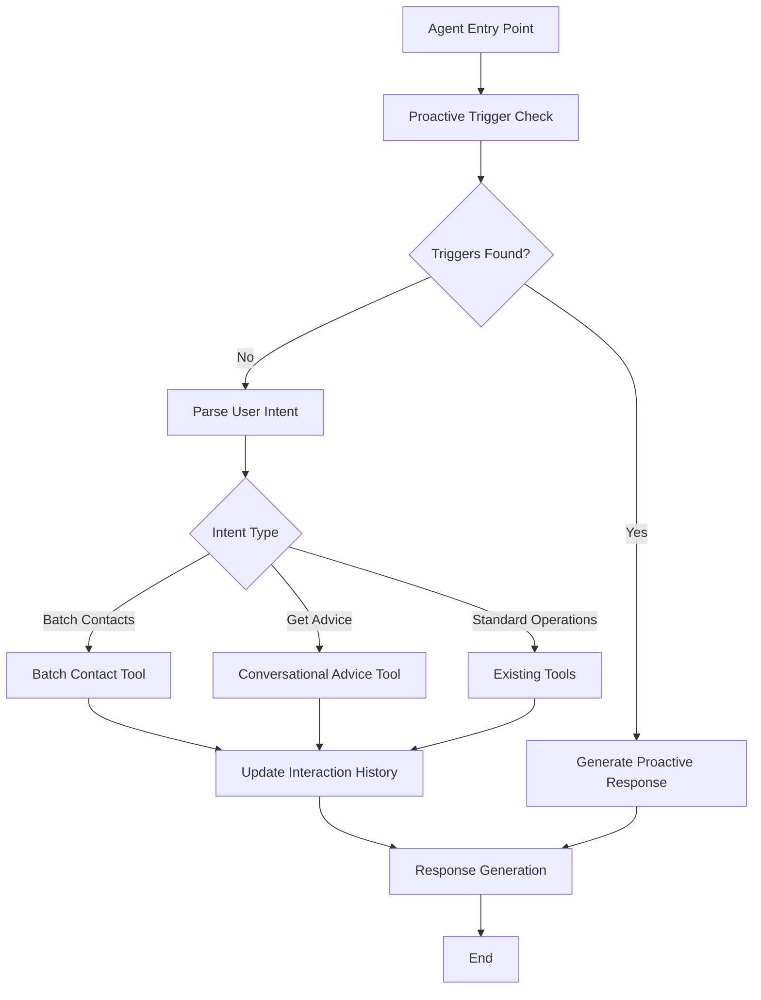
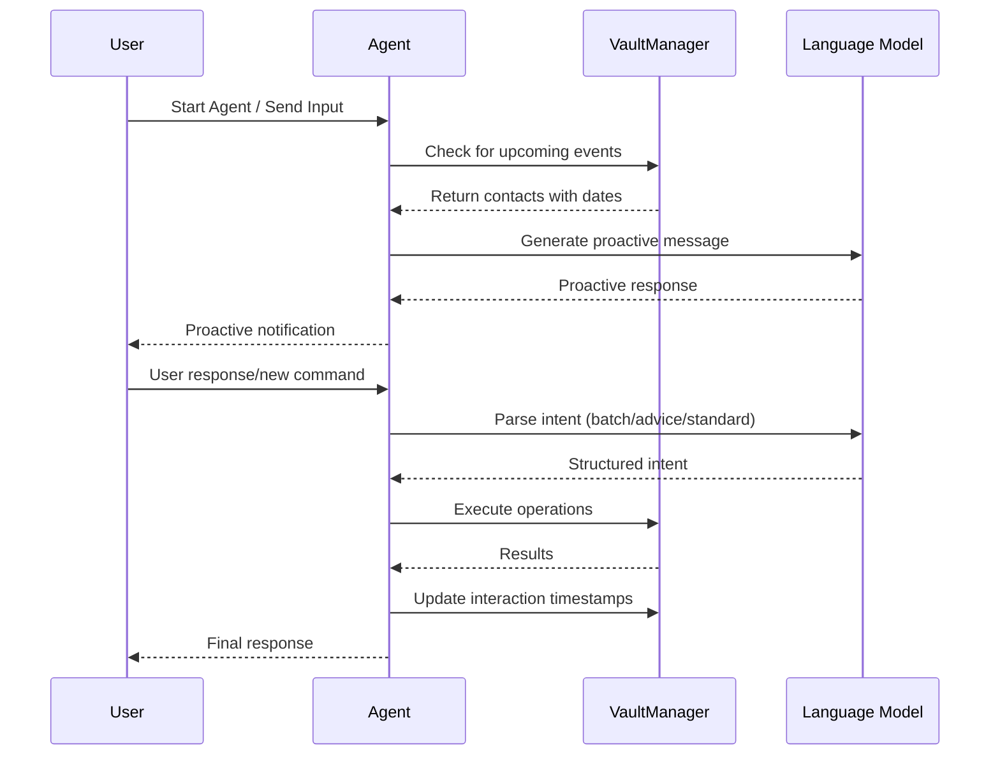

# Design Document

## Overview

The Proactive Relationship Manager Agent extends the existing LangGraph-based relationship memory system with proactive capabilities, batch operations, and conversational intelligence. The design maintains HushhMCP compliance while introducing a sophisticated workflow that can initiate conversations, manage multiple contacts simultaneously, and provide contextual advice based on stored relationship data.

The architecture leverages the existing VaultManager for secure data storage, enhances the LangGraph workflow with new nodes for proactive triggers, and extends the Pydantic models to support batch operations and priority-based relationship management.

## Architecture

### High-Level Architecture



### Enhanced LangGraph Workflow

The workflow introduces three new entry points and maintains backward compatibility:

1. **Proactive Entry**: `check_for_proactive_triggers` → `generate_proactive_response`
2. **Batch Processing**: `parse_intent` → `batch_contact_tool` → `update_interaction_history`
3. **Advice Generation**: `parse_intent` → `conversational_advice_tool`

### Data Flow



## Components and Interfaces

### Enhanced Pydantic Models

#### ContactInfo Model (Modified)
```python
class ContactInfo(BaseModel):
    """Enhanced contact information supporting priority and interaction tracking"""
    name: str = Field(..., description="Full name of the contact")
    email: Optional[str] = Field(None, description="Email address")
    phone: Optional[str] = Field(None, description="Phone number")
    company: Optional[str] = Field(None, description="Company or workplace")
    location: Optional[str] = Field(None, description="Location or address")
    notes: Optional[str] = Field(None, description="Additional notes or context")
    dates: Optional[Dict[str, str]] = Field(None, description="Important dates like birthday, anniversary (format: DD-MM)")
    # New fields
    priority: Optional[Literal["high", "medium", "low"]] = Field("medium", description="Priority for staying in touch")
    last_talked_date: Optional[str] = Field(None, description="Date of last interaction (YYYY-MM-DD format)")
```

#### UserIntent Model (Modified)
```python
class UserIntent(BaseModel):
    """Enhanced intent parsing supporting batch operations and advice requests"""
    action: Literal[
        "add_contact", "add_memory", "add_reminder", 
        "show_contacts", "show_memories", "show_reminders", 
        "search_contacts", "get_contact_details", "add_date", 
        "show_upcoming_dates", "get_advice", "unknown"  # Added get_advice
    ] = Field(..., description="The intended action")
    confidence: float = Field(..., description="Confidence level (0.0 to 1.0)")
    # Modified to support batch operations
    contact_info: Optional[List[ContactInfo]] = Field(None, description="List of contact information for batch operations")
    memory_info: Optional[MemoryInfo] = Field(None, description="Memory information if adding memory")
    reminder_info: Optional[ReminderInfo] = Field(None, description="Reminder information if setting reminder")
    date_info: Optional[DateInfo] = Field(None, description="Date information if adding important dates")
    search_query: Optional[str] = Field(None, description="Search query if searching")
    contact_name: Optional[str] = Field(None, description="Contact name for queries")
```

#### RelationshipMemoryState (Enhanced)
```python
class RelationshipMemoryState(TypedDict):
    """Enhanced state supporting proactive triggers and conversation context"""
    # Existing fields
    user_input: str
    user_id: str
    vault_key: str
    parsed_intent: Optional[UserIntent]
    result_data: List[Dict]
    response_message: str
    error: Optional[str]
    action_taken: str
    # New fields
    is_startup: bool  # Flag for startup proactive check
    proactive_triggers: List[Dict]  # Upcoming events and reconnection suggestions
    conversation_history: List[str]  # Context for follow-up conversations
```

### New LangGraph Nodes

#### 1. check_for_proactive_triggers
**Purpose**: Entry point that scans for upcoming events and reconnection opportunities

**Implementation**:
```python
def _check_for_proactive_triggers(self, state: RelationshipMemoryState) -> RelationshipMemoryState:
    """Check for proactive triggers on startup or between commands"""
    try:
        vault_manager = VaultManager(state["vault_key"])
        all_contacts = vault_manager.get_all_contacts()
        
        triggers = []
        current_date = datetime.now()
        
        # Check for upcoming birthdays/anniversaries (next 30 days)
        for contact in all_contacts:
            if contact.get('dates'):
                for date_type, date_value in contact['dates'].items():
                    # Calculate days until event
                    days_until = self._calculate_days_until_event(date_value, current_date)
                    if 0 <= days_until <= 30:
                        triggers.append({
                            'type': 'upcoming_event',
                            'contact_name': contact['name'],
                            'event_type': date_type,
                            'days_until': days_until
                        })
        
        # Check for reconnection opportunities
        for contact in all_contacts:
            days_since_contact = self._calculate_days_since_contact(contact)
            priority = contact.get('priority', 'medium')
            
            should_reconnect = (
                (priority == 'high' and days_since_contact > 7) or
                (priority == 'medium' and days_since_contact > 30) or
                (priority == 'low' and days_since_contact > 90)
            )
            
            if should_reconnect:
                triggers.append({
                    'type': 'reconnection',
                    'contact_name': contact['name'],
                    'days_since_contact': days_since_contact,
                    'priority': priority
                })
        
        state["proactive_triggers"] = triggers
        return state
        
    except Exception as e:
        state["error"] = f"Error checking proactive triggers: {str(e)}"
        state["proactive_triggers"] = []
        return state
```

#### 2. generate_proactive_response
**Purpose**: Creates natural language notifications for proactive triggers

**Implementation**:
```python
def _generate_proactive_response(self, state: RelationshipMemoryState) -> RelationshipMemoryState:
    """Generate engaging proactive messages based on triggers"""
    triggers = state["proactive_triggers"]
    
    if not triggers:
        state["response_message"] = ""
        return state
    
    # Create context for LLM
    trigger_context = self._format_triggers_for_llm(triggers)
    
    prompt = f"""
    Based on the following relationship triggers, create a friendly, engaging message:
    
    {trigger_context}
    
    Guidelines:
    - Be conversational and warm
    - Consolidate multiple triggers into one coherent message
    - Offer specific help or suggestions
    - Use emojis appropriately
    - Keep it concise but helpful
    """
    
    try:
        response = self.llm.invoke([SystemMessage(content=prompt)])
        state["response_message"] = response.content
        state["action_taken"] = "proactive_notification"
    except Exception as e:
        state["error"] = f"Error generating proactive response: {str(e)}"
        state["response_message"] = "I noticed some upcoming events, but had trouble generating a message."
    
    return state
```

#### 3. conversational_advice_tool
**Purpose**: Provides contextual advice based on stored memories

**Implementation**:
```python
def _conversational_advice_tool(self, state: RelationshipMemoryState) -> RelationshipMemoryState:
    """Generate advice based on contact memories and context"""
    intent = state["parsed_intent"]
    contact_name = intent.contact_name
    
    try:
        vault_manager = VaultManager(state["vault_key"])
        
        # Get contact and their memories
        contact = vault_manager.find_contact_by_name(contact_name)
        if not contact:
            state["response_message"] = f"I don't have information about {contact_name}. Would you like to add them first?"
            return state
        
        memories = vault_manager.get_memories_for_contact(contact['id'])
        
        # Create context for advice generation
        advice_context = self._format_memories_for_advice(contact, memories, state["user_input"])
        
        prompt = f"""
        Based on the following information about {contact_name}, provide helpful advice:
        
        {advice_context}
        
        User's question: {state["user_input"]}
        
        Guidelines:
        - Reference specific memories when relevant
        - Provide actionable suggestions
        - Be empathetic and understanding
        - If asking about gifts, consider their interests and past conversations
        - If asking about conversation topics, suggest based on shared experiences
        """
        
        response = self.llm.invoke([SystemMessage(content=prompt)])
        state["response_message"] = response.content
        state["action_taken"] = "advice_generated"
        
    except Exception as e:
        state["error"] = f"Error generating advice: {str(e)}"
        state["response_message"] = f"I had trouble accessing information about {contact_name}."
    
    return state
```

### Modified Existing Tools

#### Enhanced _add_contact_tool
**Purpose**: Handle batch contact creation with validation and error handling

**Key Changes**:
- Process `List[ContactInfo]` instead of single contact
- Individual validation for each contact
- Consolidated success/error reporting
- Automatic interaction timestamp setting

#### Enhanced _add_memory_tool
**Purpose**: Automatically update interaction history when memories are added

**Key Changes**:
- Call `update_interaction_tool` after successful memory storage
- Maintain existing functionality while tracking interaction dates

### Utility Functions

#### update_interaction_tool
```python
def _update_interaction_tool(self, vault_manager: VaultManager, contact_name: str) -> bool:
    """Update the last_talked_date for a contact to current date"""
    try:
        contact = vault_manager.find_contact_by_name(contact_name)
        if contact:
            contact['last_talked_date'] = datetime.now().strftime('%Y-%m-%d')
            vault_manager.update_contact(contact['id'], contact)
            return True
        return False
    except Exception:
        return False
```

## Data Models

### Enhanced Contact Storage Schema
```json
{
  "id": "unique_contact_id",
  "name": "John Doe",
  "email": "john@example.com",
  "phone": "+1234567890",
  "company": "Tech Corp",
  "location": "San Francisco",
  "notes": "Met at conference",
  "dates": {
    "birthday": "15-03",
    "anniversary": "22-06"
  },
  "priority": "high",
  "last_talked_date": "2024-01-15",
  "created_at": "2024-01-01T10:00:00Z",
  "updated_at": "2024-01-15T14:30:00Z"
}
```

### Proactive Trigger Schema
```json
{
  "type": "upcoming_event|reconnection",
  "contact_name": "Jane Smith",
  "event_type": "birthday",
  "days_until": 5,
  "days_since_contact": 45,
  "priority": "medium"
}
```

## Error Handling

### Batch Operation Error Handling
- **Individual Validation**: Each contact in a batch is validated separately
- **Partial Success**: System continues processing even if some contacts fail
- **Detailed Reporting**: Clear indication of which operations succeeded/failed
- **Rollback Prevention**: Failed contacts don't affect successful ones

### Proactive Check Error Handling
- **Graceful Degradation**: System continues normal operation if proactive checks fail
- **Logging**: Errors are logged but don't interrupt user workflow
- **Fallback Messages**: Generic notifications if LLM generation fails

### Vault Operation Error Handling
- **Connection Resilience**: Retry logic for temporary vault connection issues
- **Data Integrity**: Validation before writing to prevent corruption
- **User Feedback**: Clear error messages for user-facing operations

## Testing Strategy

### Unit Tests
1. **Model Validation Tests**
   - Test enhanced Pydantic models with new fields
   - Validate batch contact parsing
   - Test priority and date field validation

2. **Proactive Logic Tests**
   - Test date calculation algorithms
   - Test reconnection trigger logic
   - Test trigger consolidation

3. **Batch Processing Tests**
   - Test multiple contact parsing
   - Test partial failure scenarios
   - Test validation error handling

### Integration Tests
1. **LangGraph Workflow Tests**
   - Test proactive trigger flow
   - Test batch operation flow
   - Test advice generation flow

2. **VaultManager Integration Tests**
   - Test enhanced contact storage
   - Test interaction timestamp updates
   - Test batch operations with vault

### End-to-End Tests
1. **Proactive Scenario Tests**
   - Test startup proactive checks
   - Test proactive message generation
   - Test user response to proactive messages

2. **Batch Operation Tests**
   - Test complete batch contact import
   - Test mixed success/failure scenarios
   - Test user experience with batch results

3. **Advice Generation Tests**
   - Test advice based on stored memories
   - Test advice with insufficient data
   - Test contextual conversation flow

### Performance Tests
1. **Batch Processing Performance**
   - Test with large contact lists (100+ contacts)
   - Measure processing time and memory usage
   - Test concurrent batch operations

2. **Proactive Check Performance**
   - Test with large contact databases
   - Measure startup time impact
   - Test trigger calculation efficiency