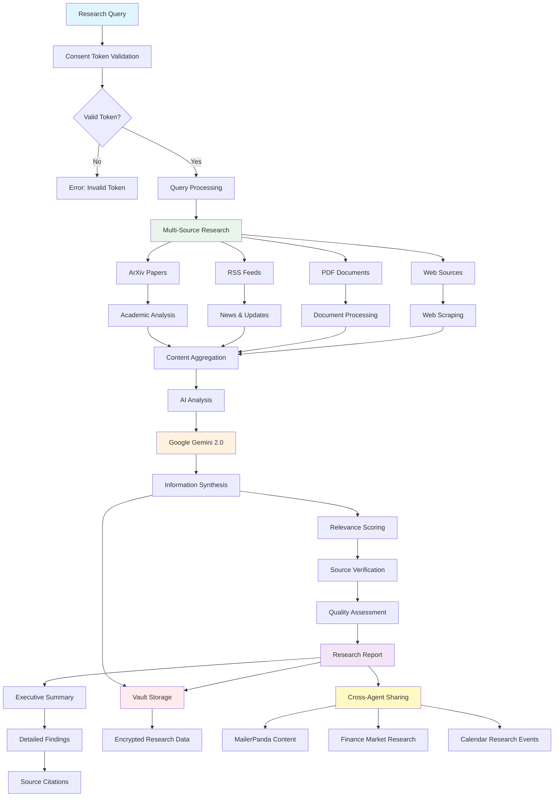

# Research Agent - AI-Powered Information Gathering and Analysis

## Agent Architecture Flow

## Workflow Description

### 1. Query Processing & Source Identification
- **Research Query**: Natural language research requests
- **Consent Validation**: HushhMCP token verification for research permissions
- **Source Planning**: Identify optimal information sources for the query

### 2. Multi-Source Information Gathering
- **Academic Sources**: ArXiv papers and scholarly articles
- **News Feeds**: RSS feeds from reputable sources
- **Document Analysis**: PDF processing and text extraction
- **Web Research**: Targeted web scraping and API integration

### 3. AI-Powered Analysis
- **Gemini Integration**: Advanced AI analysis using Google Gemini 2.0
- **Content Synthesis**: Combine information from multiple sources
- **Relevance Assessment**: Score and rank information by relevance

### 4. Quality Assurance
- **Source Verification**: Validate credibility and reliability of sources
- **Fact Checking**: Cross-reference information across multiple sources
- **Bias Detection**: Identify potential bias in source material

### 5. Report Generation
- **Executive Summary**: Concise overview of key findings
- **Detailed Analysis**: Comprehensive research findings
- **Source Citations**: Proper attribution and reference links
- **Actionable Insights**: Practical recommendations based on research

### 6. Integration & Storage
- **Cross-Agent Sharing**: Provide research data to other agents
- **Encrypted Storage**: Secure storage of research results
- **Knowledge Base**: Build cumulative research knowledge over time

## Key Features
- 📚 **Multi-Source Research**: Academic papers, news, documents, and web sources
- 🤖 **AI Analysis**: Advanced information synthesis and analysis
- 🔍 **Quality Assessment**: Source verification and bias detection
- 📊 **Comprehensive Reports**: Executive summaries with detailed findings
- 🔗 **Agent Integration**: Share research with other ecosystem agents
- 🔒 **Secure Storage**: Encrypted research data management

## API Endpoints
- `POST /agents/research_agent/execute` - Submit research query
- `GET /agents/research_agent/status` - Check research progress
- `GET /agents/research_agent/results` - Retrieve research results
- `POST /agents/research_agent/sources` - Add custom research sources

## Research Capabilities
- **Academic Research**: Scientific papers and scholarly articles
- **Market Research**: Financial data and market analysis
- **News Monitoring**: Real-time news and trend tracking
- **Competitive Analysis**: Industry and competitor research
- **Technical Documentation**: Product and technology research

## Supported Sources
- **ArXiv**: Academic papers and preprints
- **RSS Feeds**: News and content feeds
- **PDF Documents**: Document analysis and extraction
- **Web APIs**: Structured data from various services
- **Custom Sources**: User-defined research sources
